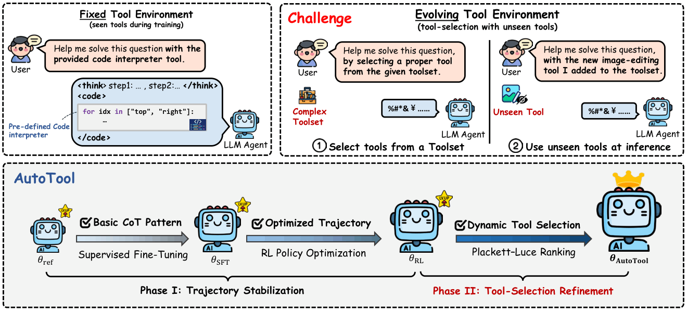
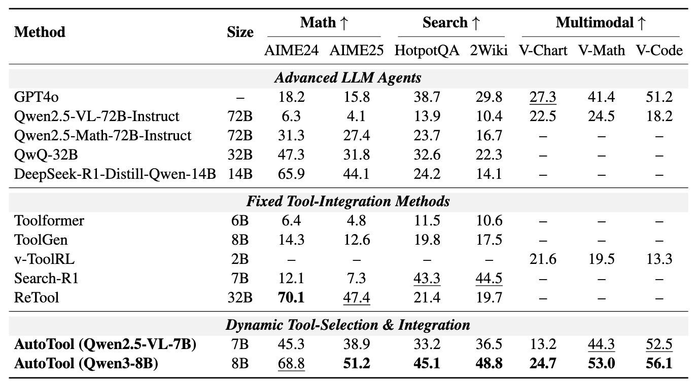
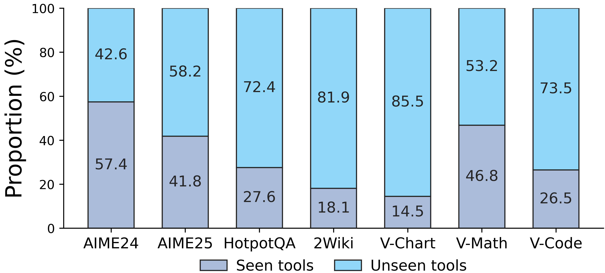
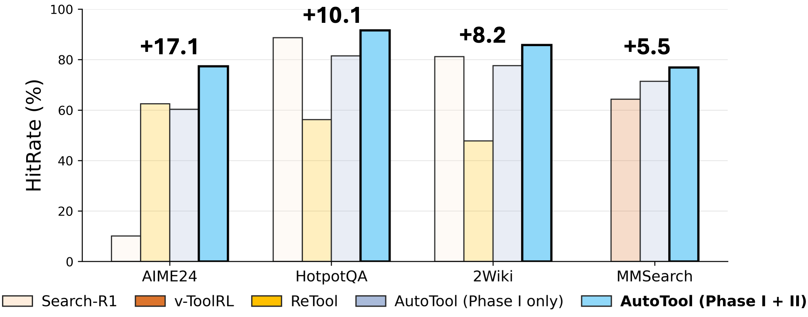

# AutoTool: Dynamic Tool Selection and Integration for Agentic Reasoning

<p align="center">
  <a href="https://arxiv.org/abs/2512.13278"></a>
  <a href="https://github.com/Gen-Verse/Open-AgentRL"></a>
  
  
  <a href="https://icml.cc/"></a>
</p>

<p align="center">
  
</p>

## 💡 News

**[2026-05]** AutoTool has been accepted to ICML 2026!

## ✨ Introduction

**AutoTool** is a training framework that equips LLM agents with **dynamic tool-selection** capabilities during long-form agentic reasoning. Instead of assuming a fixed task-specific tool inventory, AutoTool trains agents to reason over an evolving toolset, select useful tools at intermediate steps, execute them, and integrate tool feedback into the remaining trajectory.

AutoTool has three core ingredients:

- **Tool-aware trajectory generation:** agents interleave inner reasoning, tool-selection rationales, and tool integration steps.
- **Dual-phase optimization:** Phase I stabilizes tool-integrated reasoning with SFT and RL; Phase II refines tool selection with KL-regularized Plackett-Luce ranking.
- **Large-scale tool-selection data:** a 200k trajectory dataset with explicit rationales across 1,346 tools and 120 task types spanning math, science, search QA, code, and multimodal reasoning.

## 🧠 Method Overview

AutoTool trains an agent policy in two phases:

1. **Phase I: Trajectory Stabilization**  
   Supervised fine-tuning and RL policy optimization teach the model to produce coherent trajectories with reasoning, tool-selection, and tool-integration steps.

2. **Phase II: Tool-Selection Refinement**  
   AutoTool masks optimization to tool-selection segments and casts tool choice as a ranking problem over candidate rollouts. A KL-regularized Plackett-Luce objective aligns the policy with reward-consistent tool preferences.

During inference, the model can select from a tool library that grows beyond the tools seen during training. In the paper setting, AutoTool trains on 460 seen tools and evaluates with a full 1,346-tool library, including 886 unseen tools.

## 📊 Experiments Overview

AutoTool is evaluated across ten benchmarks covering math and science reasoning, search-based QA, code generation, and multimodal understanding.

### 🔎 Main Findings

<p align="center">
  
</p>

- **Math and science:** +6.4% average gain over strong agentic training baselines.
- **Search-based QA:** +4.5% average gain.
- **Code generation:** +7.7% average gain.
- **Multimodal understanding:** +6.9% average gain.
- **Unseen tools:** AutoTool often selects unseen tools in successful trajectories, showing generalization beyond memorized tool identities.

### 🧩 Tool Generalization

AutoTool successfully uses tools that were not available during training, especially in search and multimodal tasks.

<p align="center">
  
</p>

### 🎯 Tool-Selection Hit Rate

Phase-II tool-selection refinement improves hit rate across representative tasks, which correlates with stronger downstream accuracy.

<p align="center">
  
</p>

## 🚀 Getting Started

### ⚙️ Install

```bash
conda create -n autotool python=3.10 -y
conda activate autotool
pip install -r requirements.txt
```

Phase-I SFT uses the LLaMA-Factory stack under `phase1/sft`, while Phase-I RL uses VeRL-style training under `phase1/rl`. Install any backend-specific dependencies required by those frameworks before launching large-scale training.

### 🧾 Example Data

An example AutoTool training instance is provided at:

```text
data/data_example.json
```

Each instance contains a problem, toolset description, formatting instructions, tool-selection rationales, tool calls, tool feedback, and the final answer.

We are currently preparing the full training data and toolset for release, and will make them available soon.

## 🗂️ Repository Structure

```text
AutoTool/
|-- assets/
|-- data/
|   `-- data_example.json    # Example AutoTool data format
|-- phase1/
|   |-- sft/                 # Phase-I supervised fine-tuning
|   `-- rl/                  # Phase-I RL trajectory stabilization
|-- phase2/
|   |-- run_tool_selection_train.py
|   |-- script/select_train.sh
|   `-- utils/               # Tool-selection refinement utilities
|-- requirements.txt
`-- README.md
```

## 🏋️ Training

### 📝 Phase I: Supervised Fine-Tuning

```bash
cd phase1/sft
bash scripts/sft.sh
```

The default script starts from `Qwen/Qwen3-8B` and writes checkpoints under `phase1/sft/saves/`.

### 🔁 Phase I: RL Trajectory Stabilization

```bash
cd phase1/rl
bash scripts/rl_train.sh
```

The RL script expects training/validation parquet files and an SFT checkpoint path. Edit `data.train_files`, `data.val_files`, and `actor_rollout_ref.model.path` in the script before launching reproduction runs.

### 🧭 Phase II: Tool-Selection Refinement

```bash
cd phase2
bash script/select_train.sh
```

Phase II optimizes tool-selection behavior after the Phase-I agent has learned stable tool-integrated trajectories.

## 📚 Citation

If you find AutoTool useful, please kindly cite us!

```bibtex
@inproceedings{zou2026autotool,
  title={AutoTool: Dynamic Tool Selection and Integration for Agentic Reasoning},
  author={Jiaru Zou and Ling Yang and Yunzhe Qi and Sirui Chen and Mengting Ai and Ke Shen and Jingrui He and Mengdi Wang},
  booktitle={Forty-third International Conference on Machine Learning},
  year={2026}
}
```

## 🙏 Acknowledgement

This code builds on open-source agentic training ecosystems including [LLaMA-Factory](https://github.com/hiyouga/LlamaFactory) and [verl](https://github.com/verl-project/verl). We thank the authors and maintainers of these projects.
